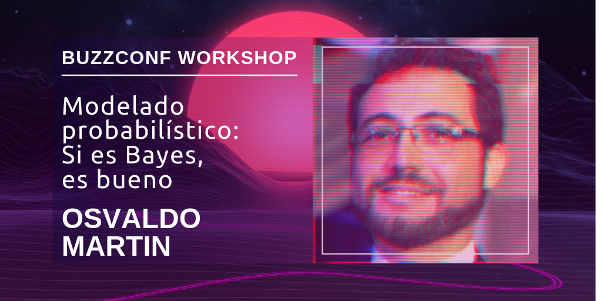

# About

The BuzzConf consists of BuzzConf Workshops and BuzzConf Talks. It also has a sister conference, [Zruput](https://zruput.org/), which is about telecommunications. 

**BuzzConf Workshops:** June 12 @ La Maquinita Belgrano, Buenos Aires, Argentina

**BuzzConf Talks:** June 13 @ Ciudad Cultural Konex, Buenos Aires, Argentina

**Zruput:** June 14 @ Ciudad Cultural Konex, Buenos Aires, Argentina

Tickets for all three are sold separately.

# Tickets

BuzzConf Talks and Workshops available [here](https://buzzconf2019.eventbrite.com.ar/)

Zruput Talks available [here](https://zruput.eventbrite.com.ar/)

# BuzzConf Topics

- functional programming
- distributed systems
- embedded systems
- big data
- artificial intelligence
- machine learning
- profiling/debugging
- programming languages design

# BuzzConf Talks
## Philip Wadler

_Keynote Talk + Programming Languages_

__Quoted Domain Specific Languages__ 

## Phil Hagelberg

_Functional Programming + Programming Languages + Embedded systems_

__A Lisp on NodeMCU: microcontroller dev without sacrificing interactivity__ 

## Simon Thompson

_Keynote Talk + Functional Programming_

__Title To Be Announced__

## Karen Serfaty

_Machine Learning_

__How to recognize good teaching practices using machine learning__

## Osvaldo Martin

_Probabilistic Programming_

__Probabilistic programming with PyMC and ArviZ__ 

La estadística Bayesiana ofrece un marco general, flexible y conceptualmente simple para el análisis de datos. Sin embargo su aplicación suele estar asociada a retos matemáticos y computacionales de gran magnitud. La programación probabilista surge en respuesta a estos retos con el objetivo de popularizar el uso de la estadística Bayesiana.

## Johanna Faliero

_Data Security_

__Data Security Chimaera: riesgos y enigmas que nos depara el tratamiento de nuestros datos__

## Sebastián Waisbrot

_Machine Learning_

__Desmitificando machine learning__

## Leandro Ostera

_Programming Languages_

__Building Web Apps like it's 1972__

# BuzzConf Workshops

Un enfoque moderno, práctico y computacional al modelado bayesiano utilizando PyMC3 y ArviZ. Una guía paso a paso con los principales conceptos teóricos y las buenas prácticas para crear, resolver y criticar modelos probabilistas aplicados a problemas prácticos.

# Code of Conduct

Please read and follow the [code of conduct](./CODE_OF_CONDUCT.md) of the conference.

---

# Cómo organizar una conferencia

### 🌃 8 a 12 meses antes
- Definir nombre, logo, estética
- Crear presencia online. Armar una página web de la conferencia, github, y redes sociales.
- Reservar el lugar
- Armar el evento en Eventbrite y poner las entradas - Initial Offer a la venta
- Abrir la Call for Presentations
- Empezar a subir algún contenido a redes sociales

### 🔮 7 meses antes
- Empezar a contactar speakers 
- Empezar a contactar sponsors
- En redes sociales tratar de conseguir la mayor cantidad de seguidores y difusión. 

### 🌔️ 5 meses antes
- Confirmar algunos speakers
- Subir la entrada a Earlybird
- Reservar alojamiento para todos y pasajes para speakers locales

### 🎏 4 meses antes
- Confirmar todos los speakers
- Armar la grilla de la conferencia con los tiempos de charlas y breaks
- Confirmar a cada orador cuanto tiempo va a tener para hablar
- Subir la entrada al precio normal
- Aumentar la difusión
- Completar la información de la web

### 🗿 3 meses antes
- Comprar pasajes para speakers de afuera
- Segunda ronda de sponsors

### 🌺 2 meses antes
- Planificar fotografía y video durante la conferencia.
- Pedir a los speakers que envíen sus diapositivas para exponer durante la conf y  preguntarles si quieren hacerlas públicas en internet (si esa es la política de la conf)

### 🐿️ 1 mes antes
- Imprimir folletería y carteles y mandar a hacer swag y bolsas
- Pedir a las empresas que manden su swag
- Imprimir entradas si se hacen en papel
- Ver el disenio del espacio donde se va a desarrollar la conf, planificar donde van los banners, los stands, la mesa de inscripciones, la comida, etc.
- Hacer descuentos y sorteos de entradas si sobra lugar
- Aumentar la difusión porque hay mucha gente que espera a estar muy cerca de la fecha para anotarse. Mandar mail a la mailing list, considerar publicidad paga.
- Se pueden publicar las slides anticipadamente para que el público las conozca
- Armar horarios de la conferencia, publicar online e informar a los speakers a qué hora es su charla.

### 🍁 7 días antes
- Armar las bolsas de swag
- Hacer backups de todo el material audiovisual que se va a proyectar en una laptop para llevar ese día
- Tener listo todo lo que se va a llevar a la conferencia (stickers, banners, sonido, computadoras, cámaras, etc)
- Avisar al catering cuánta gente eligió menú especial
- Chequear con los speakers que todo está bien

### 🐲 Justo antes de la conf
- Antes de que empiece todo probar el livestreaming si lo hay
- Probar equipos de sonido

### Durante la conf
- Publicar fotos y actualizaciones durante la charla para la gente que no pudo venir.
- Prestar atención al bienestar de los asistentes y al cumplimiento del Code of Conduct.
- Una persona controla la entrada en todo momento.

### 🌅 Después de la conf
- Enviar una encuesta a los asistentes que dejaron mail para ver en qué podemos mejorar
- Publicar los videos y fotos del evento
- Enviar agradecimientos a los speakers

---

Inspirado en: https://github.com/rust-community/events-team/blob/master/guidelines/timeline.md
